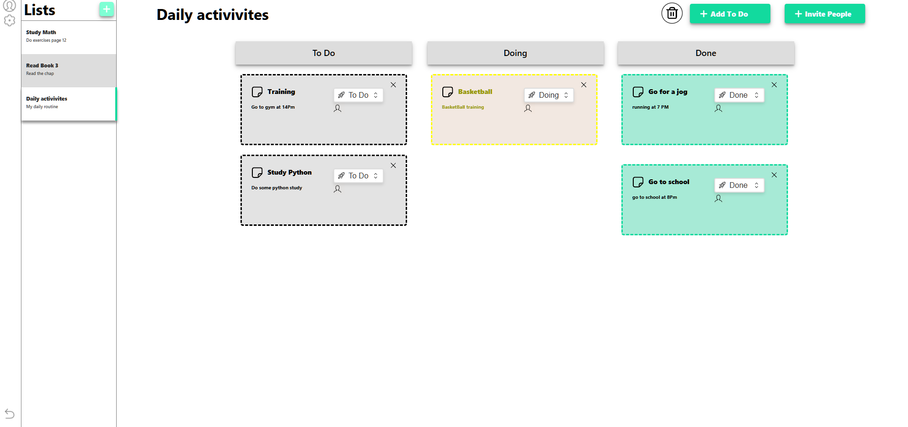
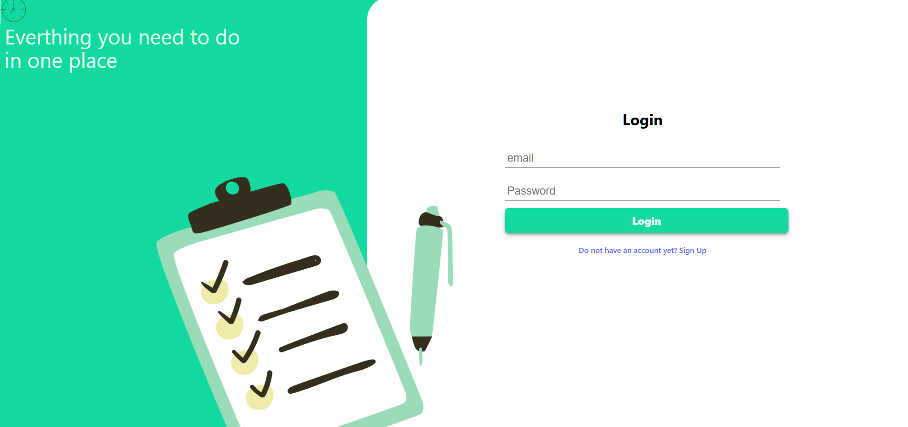
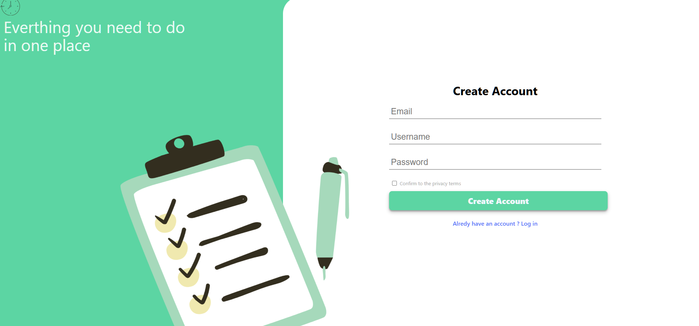
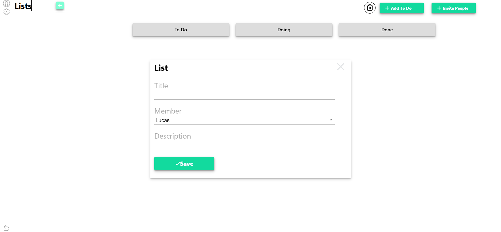
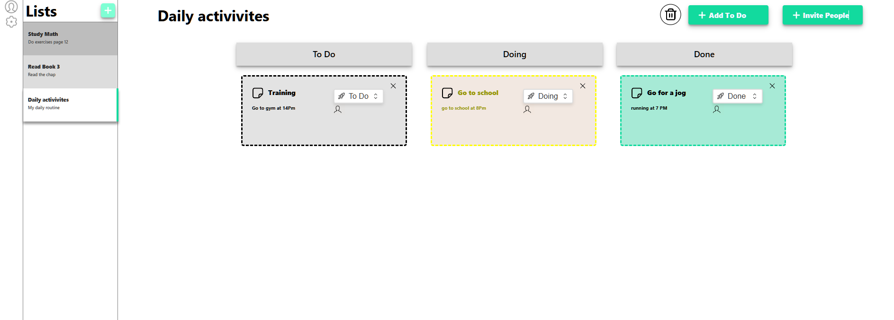
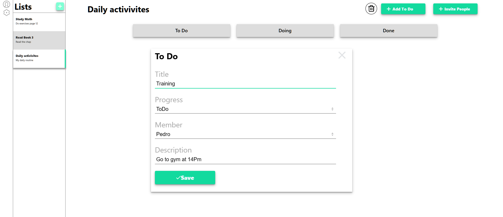

# To do List Web
A web platform for managing personal task lists.

## 📌 This is a web application designed to help users create, edit, update, and delete their to-do lists. The platform includes user authentication, allowing individuals to register and log in to securely manage their personal tasks.

### App Preview


---

## 🚀 Technologies Used

### Front-end

| Technology               | Version   | Description                                      |
|--------------------------|-----------|--------------------------------------------------|
| **React**                | ^18.2.0   | JavaScript library for building user interfaces |
| **React DOM**            | ^18.2.0   | DOM bindings for React                          |
| **TypeScript**           | ^5.2.2    | Static typing for JavaScript                    |
| **Vite**                 | ^5.2.0    | Fast front-end build tool                       |
| **React Router DOM**     | ^6.23.1   | Routing library for React apps                  |
| **React Hook Form**      | ^7.52.0   | Form handling in React                          |
| **Axios**                | ^1.7.5    | Promise-based HTTP client                       |
| **Validator**            | ^13.12.0  | String validation and sanitization              |

### Development & Tooling

| Tool                                 | Version   | Description                                     |
|--------------------------------------|-----------|-------------------------------------------------|
| **ESLint**                           | ^8.57.0   | Linter for JavaScript/TypeScript                |
| **@typescript-eslint/parser**        | ^7.2.0    | ESLint parser for TypeScript                    |
| **@typescript-eslint/eslint-plugin** | ^7.2.0    | ESLint rules for TypeScript                     |
| **eslint-plugin-react-hooks**        | ^4.6.0    | Linting rules for React Hooks                   |
| **eslint-plugin-react-refresh**      | ^0.4.6    | ESLint plugin for React Fast Refresh            |
| **@vitejs/plugin-react**             | ^4.2.1    | React plugin for Vite                           |
| **@types/react**                     | ^18.2.66  | Type definitions for React                      |
| **@types/react-dom**                 | ^18.2.22  | Type definitions for React DOM                  |
| **@types/validator**                 | ^13.12.0  | Type definitions for Validator                  |

---

## 📁 Project Structure

```bash
📦 root/
├── 📁 node_modules/ # Project dependencies
├── 📁 public/ # Static public assets (e.g. favicon, images)
├── 📁 src/ # Main source code
│ ├── 📁 assets/ # Images, icons, and other static media
│ ├── 📁 components/ # Reusable React components
│ ├── 📁 Css/ # Global and modular CSS files
│ ├── 📁 helper/ # Utility functions or helper modules
│ ├── 📁 hooks/ # Custom React hooks
│ ├── 📁 interface/ # TypeScript interfaces and types
│ └── 📁 pages/ # Page components used for routing
│ ├── 📄 app.css # Global styling for App component
│ ├── 📄 app.tsx # Main App component
│ ├── 📄 index.css # Entry CSS for the root
│ ├── 📄 main.tsx # React application bootstrap file
│ └── 📄 vite-env.d.ts # Type definitions for Vite environment
├── 📄 .eslintrc.cjs # ESLint configuration
├── 📄 .gitignore # Git ignore rules
├── 📄 index.html # HTML template used by Vite
├── 📄 package.json # Project metadata and dependencies
├── 📄 package-lock.json # Dependency lock file
├── 📄 README.md # Project documentation
├── 📄 tsconfig.json # TypeScript compiler configuration
├── 📄 tsconfig.node.json # TypeScript config for Node.js environment
└── 📄 vite.config.ts # Vite build tool configuration
```

---

## 🛠️ Features

- ✅ User registration and authentication  
- ✅ Create, update, and delete to-do lists  
- ✅ Create, update, and delete tasks within lists  
- ✅ Mark tasks as *To Do*, *In Progress*, or *Done*  
- ✅ Clean, responsive, and user-friendly interface  
- ✅ Persistent data storage using a database  
- ✅ Personal task and list management per user  
- ✅ Invite friends to collaborate on lists and tasks  

---

## 💻 How to run locally

### Prerequisites

1. Make sure you have installed:
- Node.js (v16 or newer)

### Installation

1. Clone the repository:

```bash
git clone https://github.com/Lucas-Cunhaa/ToDo-List-WEB.git
```

2. Install all the dependencies:

```bash
npm install
```

3. Run the development server:

```bash
npm run dev
```

### NOTE 
🌐 API
**This front-end connects to a RESTful API built with Node.js and Express. Make sure the server is running on the correct port (e.g., http://localhost:3000) and that the base URL is correctly configured in your Axios service.**

---

## 📷 Preview of the Project running

### Login Screen


### Register Screen


### Add List Screen


### Tasks Screen


### Add Task Screen



